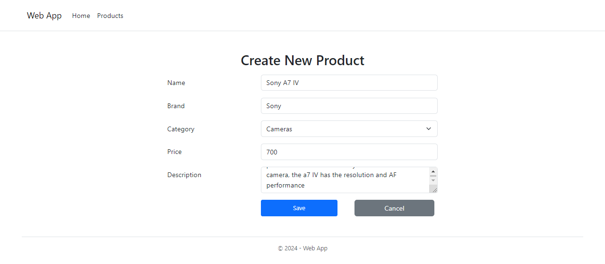

# CRUD Operations with React.js and Bootstrap

This project demonstrates basic CRUD (Create, Read, Update, Delete) operations using React.js for frontend development and Bootstrap for styling. It allows users to manage products, including adding new products, viewing existing products, updating product details, and deleting products.

## How to Run

### Prerequisites

Before running the project, make sure you have Node.js and npm (Node Package Manager) installed on your machine.

### Installation

```bash
npm install
```

### Running the Project

1. Run the JSON server to simulate a backend:
   
   ```bash
   json-server --watch db.json --port 5174
   ```

   This command will start the JSON server and watch the `db.json` file for changes on port `5174`.

2. Start the development server for the React application:

   ```bash
   npm run dev
   ```

   This command will start the React development server and open the application in your default web browser on http://localhost:5173

## Usage

Once the project is running, you can perform CRUD operations on products using the user interface provided. Here are the basic functionalities:

- **Create**: Click on the "Create" button to add a new product.
  

- **Read**: View the list of products on the homepage.
  

- **Update**: Click on the "Edit" button next to a product to update its details.
  

- **Delete**: Click on the "Delete" button next to a product to remove it from the list.
  

