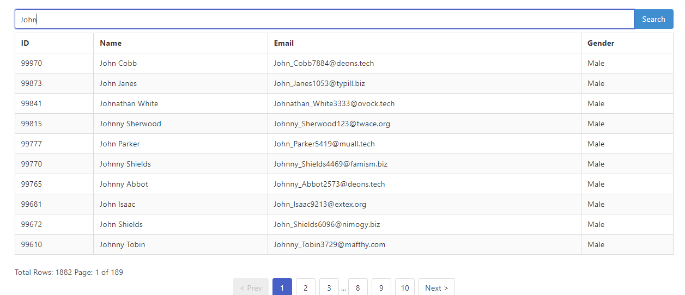

# Search & Pagination with Node.js, Express, React.js, and MySQL

This project is a demonstration of implementing search and pagination functionality using Node.js, Express, React.js, and MySQL. It loads data from a MySQL database and displays it in a paginated table format with search functionality.



## How to Run

### Prerequisites

Before running the project, you need to have the following installed:

- [XAMPP](https://www.apachefriends.org/index.html) or any other MySQL server
- [Node.js](https://nodejs.org/)
- npm (Node Package Manager)

### Setting up the Database

1. Start XAMPP and ensure that the MySQL server is running.

2. Open phpMyAdmin and create a new database named `paginate_db`.

3. Import the `users.sql` file into the `paginate_db` database. You can find the `users.sql` file in the `backend` folder of the project.


### Running the Backend

1. Navigate to the `backend` folder of the project in your terminal:

   ```bash
   cd backend
   ```

2. Install dependencies:

   ```bash
   npm install
   ```

3. Start the backend server:

   ```bash
   node index.js
   ```

   This will start the Express server, which will connect to the MySQL database and provide APIs for fetching paginated data and performing searches.

### Running the Frontend

1. Navigate to the `frontend` folder of the project in your terminal:

   ```bash
   cd frontend
   ```

2. Install dependencies:

   ```bash
   npm install
   ```

3. Start the frontend development server:

   ```bash
   npm run dev
   ```

   This will start the React development server, which will serve the frontend of the application and allow you to interact with the paginated table and search functionality.

## Technologies Used

- Node.js
- Express.js
- React.js
- MySQL
- Bulma (CSS framework)
- react-paginate (React component for pagination)
